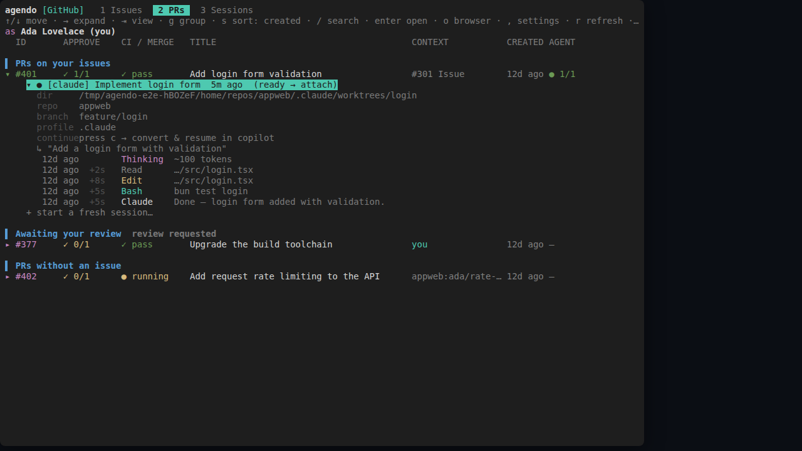

# agendo

`agendo` — a little console for launching and wrangling your Claude (and Copilot) agent sessions. (_agenda_ + _do_; also the Latin root of _agent_.)



`agendo` manages your Claude and Copilot agent sessions as tabs in one tmux session,
organized around your Azure DevOps work items or GitHub issues. It automatically
finds every session you've ever started and matches each to the PRs and issues it
belongs to — by branch name, PR/issue number, and the like — so you see what's
assigned or open, with each item's PR and CI status, then jump into (or attach to)
the agent already working on it, or spin up a fresh one in its own worktree, all from
one keyboard-driven list. Wrangling those tmux sessions is the whole point, so it
runs as a single tmux session by default.

## Run

Requires:

- **[bun](https://bun.sh)** — agendo runs on bun.
- **tmux** — agendo manages your agents as tabs in one tmux session.
- a backend CLI, auto-detected on your `PATH`:
  - **`az`** (with `az login`) for Azure DevOps, and/or
  - **`gh`** (with `gh auth login`) for GitHub.

```bash
bunx agendo            # or: bun x agendo  (npx agendo works too, if bun is installed)
bunx agendo --no-tmux  # run the menu inline, without a tmux session
```

For Azure DevOps, set your `org` / `project` / `team` / `tenant` in
`~/.agendo/config.json` first (see [Config](#config)). GitHub needs no config.

## Features

### Azure DevOps & GitHub backends

Both are auto-detected from the CLIs on your `PATH`; switch between them — and see
each one's live auth status — from the settings page (`,`). Azure DevOps lists the
work items in your team's current sprint with their linked PRs; GitHub lists issues
scoped to the repos discovered across your local sessions.

### One tmux session, one tab per agent

agendo lives in a single canonical `agendo` tmux session: the menu is tab 1, and every
agent you open or resume becomes another tab in the same session. Re-running agendo
attaches to it rather than spawning a second, so there's only ever one. (`--no-tmux`
runs it outside tmux, where each agent is a detached session you attach to.)

### Browser-style session restore

It remembers the agent tabs you had open and lazily restores them next launch — each
reappears in the tab strip but stays unloaded until you switch to it and press a key,
so startup never spawns a fleet of agents.

### Orchestrator agents that spin up their own worktrees

Every Claude agendo starts is given a small system prompt pointing at `agendo
launch`/`list`/`status`/`send`. So an agent can spin off _new_ sessions — each in its
own fresh worktree — for separate pieces of work that deserve their own PR, then
monitor and steer them through the same commands. One orchestrator session can fan a
large task out across many worktrees and coordinate them, instead of hand-rolling
tmux and `git worktree`. The sessions it starts inherit the same ability.

### Fresh sessions in isolated worktrees

Pick "start a fresh session", choose the agent and repo, and agendo creates a `git
worktree` off the repo's default branch and launches the agent there — so new work
never disturbs your current checkout.

### Cross-agent continue (Claude ↔ Copilot)

Hover a session and press `c` to continue it in the _other_ agent: agendo converts the
transcript to that agent's on-disk format and resumes it, so a conversation can move
between Claude and Copilot without losing context.

## Config

Azure DevOps connection details live in `~/.agendo/config.json` — `org`, `project`,
`team`, `tenant`. There are no baked-in defaults and nothing is auto-discovered, so
set them for your own setup (see `src/config.ts` for the shape); the token is fetched
via `az`, no PAT needed. GitHub needs no config — it scopes to the github.com repos
found across your local sessions. Your selected backend is remembered in
`~/.agendo/state.json`.

## Testing

Browser-rendered integration tests live in [`e2e/`](e2e/README.md): they spawn the
TUI in a PTY, render it in a real headless browser via [wterm](https://wterm.dev),
and drive it with Playwright against a fully mocked environment — Azure DevOps,
on-disk sessions, tmux, and git are all faked, so nothing real is touched.

```bash
bun run test:e2e:setup   # one-time: download Chromium
bun run test:e2e
```
