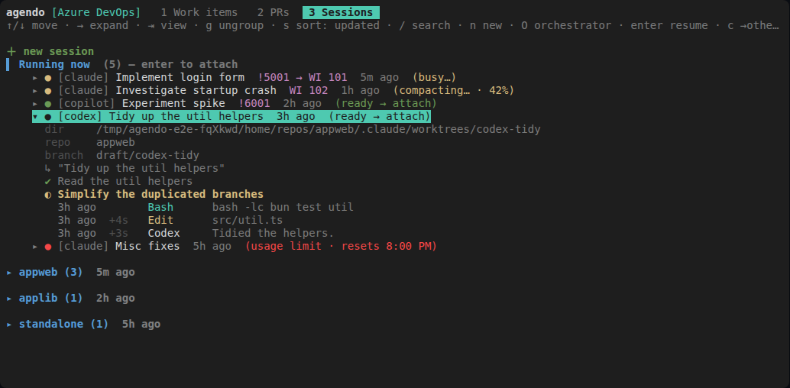

# agendo

`agendo` — a little console for launching and wrangling your Claude, Copilot and Codex agent sessions. (_agenda_ + _do_; also the Latin root of _agent_.)



`agendo` manages your Claude, Copilot and Codex agent sessions as tabs in one tmux session,
organized around your Azure DevOps work items or GitHub issues. It automatically
finds every session you've ever started and matches each to the PRs and issues it
belongs to — by branch name, PR/issue number, and the like — so you see what's
assigned or open, with each item's PR and CI status, then jump into (or attach to)
the agent already working on it, or spin up a fresh one in its own worktree, all from
one keyboard-driven list. Wrangling those tmux sessions is the whole point, so it
runs as a single tmux session by default.

## Run

Requires:

- **[bun](https://bun.sh)** — agendo runs on bun.
- **tmux** — agendo manages your agents as tabs in one tmux session.
- a backend CLI, auto-detected on your `PATH`:
  - **`az`** (with `az login`) for Azure DevOps, and/or
  - **`gh`** (with `gh auth login`) for GitHub.

```bash
bunx agendo            # or: bun x agendo  (npx agendo works too, if bun is installed)
bunx agendo --no-tmux  # run the menu inline, without a tmux session
```

For Azure DevOps, set your `org` / `project` / `team` / `tenant` in
`~/.agendo/config.json` first (see [Config](#config)). GitHub needs no config.

### Running a pull request

To review or test a PR, run it straight from its branch — no clone, no checkout:

```bash
bunx github:MiniGod/agendo#pull/8/head   # run agendo from PR #8
```

Handy for trying a change against your own real sessions before merging it. Swap
`8` for the PR number; `#HEAD` gets you the tip of the default branch.

## Features

### Azure DevOps & GitHub backends

Both are auto-detected from the CLIs on your `PATH`; switch between them — and see
each one's live auth status — from the settings page (`,`). Azure DevOps lists the
work items in your team's current sprint with their linked PRs; GitHub lists issues
scoped to the repos discovered across your local sessions.

### One tmux session, one tab per agent

agendo lives in a single canonical `agendo` tmux session: the menu is tab 1, and every
agent you open or resume becomes another tab in the same session. Re-running agendo
attaches to it rather than spawning a second, so there's only ever one. (`--no-tmux`
runs it outside tmux, where each agent is a detached session you attach to.)

### Browser-style session restore

It remembers the agent tabs you had open and lazily restores them next launch — each
reappears in the tab strip but stays unloaded until you switch to it and press a key,
so startup never spawns a fleet of agents.

### Orchestrator agents that spin up their own worktrees

Every Claude agendo starts is given a small system prompt pointing at `agendo
launch`/`list`/`status`/`send`/`open`/`wait`/`close`. So an agent can spin off _new_
sessions — each in its own fresh worktree — for separate pieces of work that deserve
their own PR, then monitor, steer and finally close them through the same commands. One
orchestrator session can fan a large task out across many worktrees and coordinate them,
instead of hand-rolling tmux and `git worktree`. The sessions it starts inherit the same
ability.

To follow them, an orchestrator should be _told_, not poll. `agendo wait` blocks until
a watched session settles — a non-busy state, or its window closing — so it can be run
in the background with its **exit** as the notification. A session parked at its usage
cap is the one thing that stops without being _done_: the wait wakes on it promptly,
but exits non-zero with `woke: "blocked"` and the session's `limitResetAt`, so a capped
session is never mistaken for finished work (an explicit `--state`/`--not` is never
pre-empted that way, so you can still wait _through_ a cap):

```sh
agendo wait --repo myapp --any --json --timeout 30m
```

`--any` returns on the first of several sessions to settle, so one long-running session
can't hide the others; `--json` says why it woke and gives each session's `from → state`,
so the wake needs no follow-up `list`. `--state <s>` waits for one exact state — e.g.
`--state limited` to hear the moment a session hits its usage cap. The alternative —
re-running `status` on a guessed cadence — either fires too often or finds out too late.

`--state dialog` means a question awaiting *your* decision; the Claude CLI's own resume
dialog isn't one (see [`resumeDialogChoice`](#resumedialogchoice) — it reads **ready**),
so it won't wake that wait. When a wake does find a session parked there, `--json` says
so with `resumeDialog: true`: nothing has run yet, so the activity is the previous run's.

When a session is finished with, `agendo close <id>` ends its window and only that — the
worktree, branch and commits stay on disk, and `agendo resume <id>` brings it back — so
no one has to reach for a raw `tmux kill-window`. A `wait` on a session closed underneath
it doesn't hang: the window vanishing settles that session as `exited`.

### Telling a finished session from a stalled one

A session that fell over mid-task 22 hours ago and one that answered cleanly 20
seconds ago both sit at a `ready` prompt. So `agendo list`/`status` also report how
long since a session last did anything, and mark a live, non-busy one that has been
silent past a threshold (4h by default — `stalledAfterMinutes` in
`~/.agendo/config.json`, or `--stalled-after <dur>`) with `⚠stalled`. That flag only
ever means "nothing has happened for that long"; agendo cannot know whether the work
finished. Alongside it, `--json` carries `idleSeconds` and whether the checkout holds
commits the remote doesn't — read straight from its `.git` refs, never by shelling out
to `git` — which is usually enough for an orchestrator to spot a parked session
without reading its transcript. It is the same "has it stopped working?" test `wait`
uses, so the two agree by construction: `wait` tells you a session settled, and the
stall marker tells you one settled a long time ago and nobody came back. A session
parked on the resume dialog is the one exception: it reads `ready` and its recorded
activity is hours old, but it hasn't run yet, so it is never marked stalled — `--json`
carries `resumeDialog: true` to say why. A session parked at its usage cap is excluded
for the same reason: `limited` means waiting on a quota reset (the row shows when it
lifts), not hung, so it is never marked stalled either.

What that does and doesn't catch, from real sessions:

| Session state | Reported as | Caught? |
| --- | --- | --- |
| Finished its turn, sitting at an empty input box | `ready` + idle age, `⚠stalled` past the threshold | **Yes**, and it is the case the feature exists for — but only by *duration*. Under the threshold, done-20-minutes-ago and wedged-20-minutes-ago are still the same row. |
| Parked at a usage cap | `limited` + `limitResetAt` | **Yes** — and deliberately never `⚠stalled`: it resumes on its own. |
| Parked on Claude's resume dialog | `ready` + `resumeDialog: true` | **Yes** — never `⚠stalled`; nothing has run yet, so the idle age is the previous run's. |
| Feedback survey on screen (numbered options above a live input box) | `ready` | **Yes** — a menu above a *live* input box is not a dialog; pinned as a negative test. |
| Busy-waiting: `until [ -f /sentinel ]; do sleep 30; done`, for an hour | `busy` | **No — known gap.** The pane is genuinely active, so neither readiness nor idle age moves. A session can spin forever and look like one that is working. Detecting it needs a signal this PR doesn't have (no assistant turn despite an active pane), and is the obvious next step. |

The honest summary: `⚠stalled` answers "has anything happened lately", not "is this
finished" and not "is this making progress". It catches the session that stopped;
it does not catch the session that is busy doing nothing.

### Orchestrator mode, one keypress away

Press `O` in the Sessions view — or run `agendo launch --orchestrator "<goal>"` — to
start a session that is _only_ a coordinator. It gets the orchestrator instructions
injected into its system prompt: write no project code, split the goal into units,
launch one background session per unit (each running an implement → sub-agent review →
fix loop until a review pass comes back clean), keep a live task list, parallelize
independent units, monitor via `list`/`status` and steer via `send`, then squash-merge
each finished branch into the main branch — no PRs. The framing is re-injected on
resume, so a restored orchestrator doesn't quietly turn back into an implementer.

Unlike every other launch, an orchestrator runs in the repo's **main checkout** rather
than a worktree: git allows the main branch in only one working tree, and that's where
its merges have to land. It writes no project code, so it needs no isolation of its own
— pass `--worktree` (or pick "New git worktree") if you want it anyway.

Because it acts on your main checkout and spawns further sessions, an orchestrator also
**keeps its approval prompts** — it's the one background launch that isn't auto-approved.
Add `--unattended` to waive them once you're happy to let it run on its own. For the same
reason `--orchestrator` is documented here and in `--help`, but deliberately left out of
`agendo --llm`: that guide is injected into every launched session, and a worktree-sandboxed
agent shouldn't be able to read its way into starting an orchestrator in your main checkout.

### Fresh sessions in isolated worktrees

Pick "start a fresh session", choose the agent and repo, and agendo creates a `git
worktree` off the repo's default branch and launches the agent there — so new work
never disturbs your current checkout.

### Three agents, one list

Claude Code, Copilot CLI and Codex CLI sessions are all discovered from disk and
resumed natively (`claude --resume`, `copilot --resume=<id>`, `codex resume <id>`);
the agent picker offers all three for a fresh session. Codex assigns its own session
id rather than accepting one, so a codex session appears in the list once it has
started, and `agendo launch --codex` prints no id up front. Autonomous codex sessions
run under `--approve-for-me` — the analogue of Claude's auto mode, where each approval
is decided by codex's own classifier instead of being asked, still inside the
workspace-write sandbox.

Readiness (what `agendo status` reports and what `send`/`wait` gate on) is read from
each pane's own TUI, and codex's looks nothing like Claude's, so it gets its own
classifier. One thing to know: codex's footer is configurable via `/statusline`, and
the **run-state** field (`Ready` / `Working` / `Thinking`) is the only positive
evidence a codex session is idle. Leave it enabled. With it switched off a running
turn is still detected — the `• … (25s • esc to interrupt)` line above the box gives
it away — but an idle pane reads `unknown` rather than `ready`, and `send` refuses
instead of guessing. That's deliberate: codex accepts typing mid-turn (it queues it)
and parks a dim example prompt in the box, so an empty-looking box is never on its own
permission to send.

### Cross-agent continue (Claude ↔ Copilot)

Hover a session and press `c` to continue it in the _other_ agent: agendo converts the
transcript to that agent's on-disk format and resumes it, so a conversation can move
between Claude and Copilot without losing context. (Claude and Copilot only — the
converter has no Codex format.)

### Move a session between Claude profiles

If you run more than one Claude login — `~/.claude`, `~/.claude-work`, anything
matching `~/.claude*` with a `projects/` folder — a session sometimes lands in the
wrong one. Hover it and press `m` to pick another profile; agendo relocates the
transcript, its sidecar dir (tool results, sub-agents, workflow runs) and the
session's `session-env/` + `tasks/` state, so `--resume` finds it under the right
subscription. It refuses rather than clobber anything already at the destination,
falls back to copy-then-delete across filesystems, and won't touch a session that is
currently running — exit it first.

## Config

Azure DevOps connection details live in `~/.agendo/config.json` — `org`, `project`,
`team`, `tenant`. There are no baked-in defaults and nothing is auto-discovered, so
set them for your own setup (see `src/config.ts` for the shape); the token is fetched
via `az`, no PAT needed. GitHub needs no config — it scopes to the github.com repos
found across your local sessions. The stall threshold (`stalledAfterMinutes`, default
240) lives in the same file. Your selected backend is remembered in
`~/.agendo/state.json`.

Opening a PR or work item in a browser (the `o` key, or `agendo open <id>`) uses your
platform's default opener — `xdg-open`, `open`, or `start`. Set `AGENDO_BROWSER` to the
executable to use instead, for hosts where that default isn't right (containers, WSL).
Where nothing can be launched at all, `agendo open` still prints the full URL.

### `resumeDialogChoice`

Resuming a large session, the Claude CLI first asks how to reload it (_"Resume from
summary (recommended)"_ / _"Resume full session as-is"_). agendo reports a session
parked there as **ready**, not blocked, and answers the dialog itself the next time
you `send` to it — then waits for the input box to actually come back before
delivering your message.

```jsonc
// ~/.agendo/config.json
{ "resumeDialogChoice": "summary" }  // default: whatever Claude marks (recommended)
{ "resumeDialogChoice": "as-is" }    // resume the full session, at full token cost
```

The dialog's third option, _"Don't ask me again"_, is deliberately not offered:
it changes your global Claude CLI behaviour permanently, which is your call to make.

## Testing

Browser-rendered integration tests live in [`e2e/`](e2e/README.md): they spawn the
TUI in a PTY, render it in a real headless browser via [wterm](https://wterm.dev),
and drive it with Playwright against a fully mocked environment — Azure DevOps,
on-disk sessions, tmux, and git are all faked, so nothing real is touched.

```bash
bun run test:e2e:setup   # one-time: download Chromium
bun run test:e2e
```
